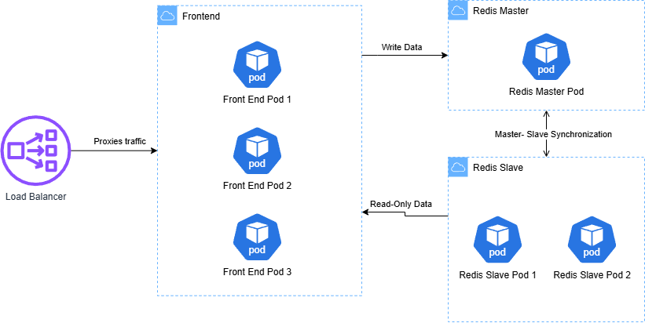
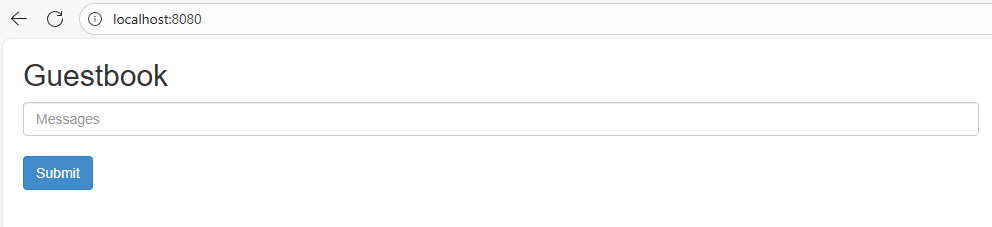
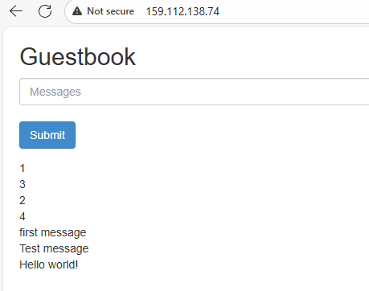

# Deploy a High Availability Guestbook App with k8s

This is a modification of Google K8s Tutorials [URL](https://cloud.google.com/kubernetes-engine/docs/tutorials/guestbook).

## Why?

I've decided do this guide because their tutorial only supports AMD architecture, and not ARM architecture.

## What you need

- You have to need a correctly connection with your cluster in your local machine (or cloud shell).

## Let's get started

### Step 1: Understanding the architecture in our application



How we see in this diagram, we will deploy the next components:

- Redis Master: It'll be persisting data from our users through our Frontend Application.

- Redis Slave: A read-only redis server, responsible for syncing data from the Redis master for reading purposes.

- Frontend Application: A guestbook application with read and write operations. It will be reading data from Redis Slave and writing data to Redis Master.

- Load Balancer (optional): It'll be proxing traffic to our Frontend Application.

### Step 2: Applying redis-master deployment and service

1. First, we must apply the deployment file.

    ```cli
    kubectl apply -f ./redis-master-deployment.yaml
    ```

    It'll show something like:

    ```cli
    deployment.apps/redis-master created
    ```

1. We must ensure our pod is deployed correctly.

    ```cli
    kubectl get pod
    ```

    It'll show something like:

    ```cli
    NAME                           READY   STATUS              RESTARTS   AGE
    redis-master-d8bf97584-xp4mh   0/1     ContainerCreating   0          3s
    ```

    We have to wait until it's state shows `Running` (we have to write `kubectl get pod` again)

    ```cli
    NAME                           READY   STATUS    RESTARTS   AGE
    redis-master-d8bf97584-xp4mh   1/1     Running   0          3m40s
    ```

1. We will test if it's works well (write and read operations directly)

    The next line is used to connect directly with our container and use redis-cli in its console

    ```cli
    kubectl exec -it redis-master-d8bf97584-xp4mh -- redis-cli 
    ```

    If all works well, we'll see a CLI, then we must test a `write` operation

    ```cli
    127.0.0.1:6379> SET testkey "test-value"
    ```

    It'll show an OK message

    ```cli
    OK
    127.0.0.1:6379>
    ```

    Now, we'll test whether the `read` operation works as well.

    ```cli
    127.0.0.1:6379> GET testkey
    "test-value"
    127.0.0.1:6379>
    ```

    `Ctrl + C` to exit.

1. Once we tested our pod, we must apply the service file.

    ```cli
    kubectl apply -f ./redis-master-service.yaml
    ```

    It'll show something like:

    ```cli
    service/redis-master created
    ```

1. We must ensure our service is deployed correctly.

    ```cli
    kubectl get svc
    ```

    It'll show something like:

    ```cli
    NAME           TYPE        CLUSTER-IP      EXTERNAL-IP   PORT(S)             AGE
    kubernetes     ClusterIP   10.96.0.1       <none>        443/TCP,12250/TCP   25h
    redis-master   ClusterIP   10.96.190.128   <none>        6379/TCP            14s
    ```

### Step 3: Applying redis-slave deployment and service

1. First, we must apply the deployment file.

    ```cli
    kubectl apply -f ./redis-slave-deployment.yaml
    ```

    It'll show something like:

    ```cli
    deployment.apps/redis-slave created
    ```

1. We must ensure our pod is deployed correctly.

    ```cli
    kubectl get pod
    ```

    It'll show something like:

    ```cli
    NAME                           READY   STATUS              RESTARTS   AGE
    redis-master-d8bf97584-xp4mh   1/1     Running             0          15m
    redis-slave-774499f54d-d244f   0/1     ContainerCreating   0          5s
    redis-slave-774499f54d-jr47p   0/1     ContainerCreating   0          5s
    ```

    We have to wait until it's state shows `Running` (we have to write `kubectl get pod` again)

    ```cli
    NAME                           READY   STATUS    RESTARTS   AGE
    redis-master-d8bf97584-xp4mh   1/1     Running   0          15m
    redis-slave-774499f54d-d244f   1/1     Running   0          9s
    redis-slave-774499f54d-jr47p   1/1     Running   0          9s
    ```

1. We will test if it's works well (write and read operations, as well as synchronization with the master.)

    The next line is used to connect directly with our container and use redis-cli in its console, we can use whichever pod we have deployed (I will use the first pod `redis-slave-774499f54d-d244f`).

    ```cli
    kubectl exec -it redis-slave-774499f54d-d244f -- redis-cli 
    ```

    If all works well, we'll see a CLI, then we must test a `write` operation

    ```cli
    127.0.0.1:6379> SET test-slave "test-slave-value"
    ```

    It will show an error message, but don't worry — it is the expected behavior.

    ```cli
    (error) READONLY You can't write against a read only replica.
    127.0.0.1:6379> 
    ```

    Next, we will test the read operation, we can use our `key` we have used on Master Redis pod

    ```cli
    127.0.0.1:6379> get testkey
    "test-value"
    127.0.0.1:6379>
    ```

    And that's all, we have tested write, read and synchronization. Then `Ctrl + C` to exit.

    If the key doesn't exists, you have to see the logs, and you must troubleshooting the error.

    ```cli
    kubectl logs redis-slave-774499f54d-d244f --tail=15
    ```

1. Once we tested our pod, we must apply the service file.

    ```cli
    kubectl apply -f ./redis-slave-service.yaml
    ```

    It'll show something like:

    ```cli
    service/redis-slave created
    ```

1. We must ensure our service is deployed correctly.

    ```cli
    kubectl get svc
    ```

    It'll show something like:

    ```cli
    NAME           TYPE        CLUSTER-IP      EXTERNAL-IP   PORT(S)             AGE
    kubernetes     ClusterIP   10.96.0.1       <none>        443/TCP,12250/TCP   27h
    redis-master   ClusterIP   10.96.190.128   <none>        6379/TCP            157m
    redis-slave    ClusterIP   10.96.26.172    <none>        6379/TCP            16s
    ```

### Step 4: Applying Frontend deployment

1. First, we must apply the deployment file.

    ```cli
    kubectl apply -f ./frontend-deployment.yaml
    ```

    It'll show something like:

    ```cli
    deployment.apps/frontend created
    ```

1. We must ensure our pod is deployed correctly.

    ```cli
    kubectl get pod
    ```

    It'll show something like:

    ```cli
    NAME                           READY   STATUS              RESTARTS   AGE
    frontend-6c75854998-bttst      0/1     ContainerCreating   0          8s 
    frontend-6c75854998-lgpgf      0/1     ContainerCreating   0          8s
    frontend-6c75854998-wvgmv      0/1     ContainerCreating   0          8s
    redis-master-d8bf97584-xp4mh   1/1     Running             0          163m
    redis-slave-774499f54d-d244f   1/1     Running             0          148m
    redis-slave-774499f54d-jr47p   1/1     Running             0          148m
    ```

    We have to wait until it's state shows `Running` (we have to write `kubectl get pod` again)

    ```cli
    NAME                           READY   STATUS    RESTARTS   AGE
    frontend-6c75854998-bttst      1/1     Running   0          85s
    frontend-6c75854998-lgpgf      1/1     Running   0          85s
    frontend-6c75854998-wvgmv      1/1     Running   0          85s
    redis-master-d8bf97584-xp4mh   1/1     Running   0          165m
    redis-slave-774499f54d-d244f   1/1     Running   0          149m
    redis-slave-774499f54d-jr47p   1/1     Running   0          149m
    ```

### Step 5: We will deploy our Frontend Service without Load Balancer first

1. We need to make sure that the file has the following structure (It hasn't spec.type = LoadBalancer)

    ```yaml
    apiVersion: v1
    kind: Service
    metadata:
      name: frontend
      labels:
        app: guestbook
        tier: frontend
    spec:
      ports:
      - port: 80
      selector:
        app: guestbook
        tier: frontend
    ```

1. Then we'll deploy our Frontend service

    ```cli
    kubectl apply -f ./frontend-service.yaml
    ```

    It'll show something like:

    ```cli
    service/frontend created
    ```

1. Test the application

    We need to set up a port forwarding directly to our deployment.

    ```cli
    kubectl port-forward deployment/frontend 8080:80
    ```

    Where:

      - 8080 is our local port
      - 80 is our frontend port

    Then, we have to use our browser and go to localhost:8080

    

### Step 6: We will deploy our Frontend Service WITH Load Balancer

1. We have to delete our service without load balancer.

    ```cli
    kubectl delete svc frontend
    ```

    It'll show something like:

    ```cli
    service "frontend" deleted
    ```

1. We need to make sure that the file has the following structure (It HAS spec.type = LoadBalancer)

    ```yaml
    apiVersion: v1
    kind: Service
    metadata:
      name: frontend
      labels:
        app: guestbook
        tier: frontend
    spec:
      type: LoadBalancer #<---- This line is new
      ports:
      - port: 80
      selector:
        app: guestbook
        tier: frontend
    ```

1. Then we'll deploy our Frontend service

    ```cli
    kubectl apply -f ./frontend-service.yaml
    ```

    It'll show something like:

    ```cli
    service/frontend created
    ```

1. Test the application

    We need to connect to the public IP of our Load Balancer, to see it, we have to list all our services:

    ```cli
    kubectl get svc
    ```

    ```cli
    NAME           TYPE           CLUSTER-IP      EXTERNAL-IP   PORT(S)             AGE
    frontend       LoadBalancer   10.96.103.174   <pending>     80:32144/TCP        15s
    ```

    We have to wait until EXTERNAL-IP be exposed. It'll show something like this:

    ```cli
    NAME           TYPE           CLUSTER-IP      EXTERNAL-IP      PORT(S)             AGE
    frontend       LoadBalancer   10.96.103.174   159.112.138.74   80:32144/TCP        98s
    ```

    Then, we have to use our browser and go to 159.112.138.74 (this is the external Ip for load balancer)

    
